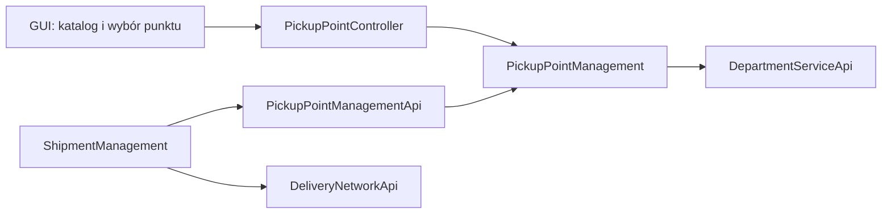

# PickupPoint — projekt domeny backendu

Status: implementacja rozpoczęta, 2026-09-09. Dokument opisuje docelowe zachowanie i stan przyrostów.
Projekt GUI: [PickupPoint GUI](../../managerv2gui/docs/pickup-point-gui-design.md).

Przyjęte decyzje produktowe: osobny katalog dla każdego operatora, jeden oddział obsługujący punkt,
nieodwracalne zamknięcie i ręczne zarządzanie katalogiem w pierwszym etapie. Integracje sieci zewnętrznych
oraz fizyczna obsługa paczek są osobnymi etapami, a nie warunkiem wdrożenia katalogu.

## 1. Decyzja i zakres

`PickupPoint` to fizyczny punkt, w którym nadawca pozostawia przesyłkę lub odbiorca ją odbiera.
Jeden punkt może obsługiwać nadania, odbiory albo obie usługi. Może być placówką z obsługą lub automatem paczkowym.

Tworzymy osobny kontekst `PickupPointManagement`, uruchamiany w istniejącym monolicie `Application`.
Punkt należy do jednego operatora systemu i ma jeden oddział obsługujący (`DepartmentId`).
Operator systemu (`OperatorId`) i marka zewnętrznej sieci punktów to różne pojęcia.

Pierwszy etap obejmuje katalog, konfigurację, wyszukiwanie, wybór punktów w przesyłce i walidację ich użycia.
Obsługa skrytek, zajętość, rezerwacje, PIN/QR, przyjęcie fizycznej paczki, wydanie odbiorcy, terminy odbioru,
powiadomienia oraz synchronizacja z przewoźnikami wymagają kolejnych przypadków użycia. Sam wybór punktu nie realizuje tych operacji.

## 2. Stan zastany

Sprawdzone w bieżącym drzewie roboczym, obejmującym także niezacommitowane zmiany:

- `Common/.../identificator/PickupPointId.java` zawiera identyfikator UUID.
- `PickupMethod` ma wartości `DEPARTMENT`, `COURIER`, `PICKUP_POINT`, `LOCKER`.
- `DeliveryMethod` ma wartości `COURIER`, `PICKUP_POINT`, `LOCKER`.
- `ShipmentPortImpl.create` zapisuje `pickupPointId` tylko dla nadania w punkcie lub automacie;
  ustala wtedy początkowy status `PLANNED`. Nie sprawdza istnienia ani dostępności punktu.
- Oddział docelowy jest wyznaczany na podstawie adresu odbiorcy, także przy doręczeniu do punktu.
- Nie ma katalogu punktów ani odrębnego identyfikatora punktu doręczenia.
- GUI przyjmuje identyfikator punktu nadania jako tekst. `DeliveryPointMapDialog` wyświetla podkład mapy,
  ale nie pobiera punktów i nie przekazuje wyboru do formularza.
- Wzorzec modułów i adapterów zapewnia `DeliveryNetwork`; izolację operatorów zapewniają
  `OperatorContextProvider`, `BelongsToOperator` i `BaseRepository`.

## 3. Granice odpowiedzialności

| Kontekst | Własność |
|---|---|
| `PickupPointManagement` | Tożsamość punktu, adres, lokalizacja, typ, usługi, godziny, status, oddział obsługujący. |
| `ShipmentManagement` | Wybrane punkty nadania i doręczenia, ich historyczne dane, walidacja konfiguracji przesyłki, jej cykl życia. |
| `DepartmentService` | Tożsamość i stan oddziału; punkt nie tworzy własnej kopii encji Department. |
| `DeliveryNetwork` | Połączenia między oddziałami. Punkt jest końcówką trasy przypisaną do oddziału, nie nowym typem węzła grafu. |
| `OrganisationStructure` / `Authorization` | Operator, użytkownicy, istniejące uprawnienia i kontekst uwierzytelnienia. |
| `RouteTrackerFlow` | Historia zdarzeń przesyłki; nie zarządza katalogiem punktów. |



## 4. Agregat i obiekty wartości

Korzeń agregatu: `PickupPoint`. Nie zawiera kolekcji przesyłek ani oddziałowych encji JPA.

| Pole | Typ / wymaganie | Znaczenie |
|---|---|---|
| `pickupPointId` | istniejący `PickupPointId`, UUID | Generowany przez backend, niezmienny. |
| `code` | `PickupPointCode`, 2–40 znaków | Niezmienny kod biznesowy, np. `WAW-PP-001`; unikalny w obrębie operatora. |
| `name` | 1–160 znaków | Nazwa widoczna dla użytkowników. |
| `type` | `SERVICE_POINT` / `PARCEL_LOCKER` | Placówka z obsługą / automat paczkowy. |
| `status` | `ACTIVE` / `SUSPENDED` / `CLOSED` | Cykl życia punktu. |
| `capabilities` | niepusty zbiór `DROP_OFF`, `COLLECTION` | Nadanie przez nadawcę / odbiór przez odbiorcę. |
| `address` | `PickupPointAddress` | Kraj, kod pocztowy, miasto, ulica, numer budynku, opcjonalny lokal. |
| `coordinates` | `GeoCoordinates` | Szerokość i długość wyznaczane przez backend z adresu za pomocą PathFinder. |
| `departmentId` | `DepartmentId` | Aktywny oddział obsługujący. |
| `contact` | opcjonalny `PickupPointContact` | Telefon i e-mail punktu. |
| `accessInstructions` | opcjonalny tekst, do 1000 znaków | Np. wejście od parkingu, lokalizacja automatu. |
| `openingSchedule` | `OpeningSchedule` | Strefa czasowa, tryb 24/7 lub tygodniowe przedziały oraz wyjątki datowane. |
| `servicePolicy` | `PickupPointServicePolicy` | Obsługiwane rozmiary przesyłek i zgoda na przesyłki z dangerous goods. |
| `externalReference` | opcjonalne `ExternalPointReference` | Para `networkCode`, `pointCode`; zewnętrzny kod nie zastępuje UUID. |
| `version` | liczba całkowita >= 0 | Kontrola równoczesnych zmian. |
| `createdAt`, `updatedAt` | `Instant` | Czas serwerowy. |

Utworzenie wymaga pełnej konfiguracji, a punkt powstaje od razu jako aktywny.

`code` normalizujemy przez trim i wielkie litery niezależnie od locale; dozwolone znaki: `A-Z`, `0-9`, `-`, `_`.
Kod pozostaje zarezerwowany również po zamknięciu punktu. UUID nie podlega edycji.
Nazwa, kontakt, instrukcje, adres, współrzędne i typ mogą być edytowane, dopóki punkt nie jest zamknięty.

Metody agregatu: `create`, `updateDetails`, `changeType`, `changeCapabilities`, `changeOpeningSchedule`,
`changeServicePolicy`, `suspend`, `resume`, `close`, `snapshot`.
Metody egzekwują reguły biznesowe; aplikacja pobiera dane oddziału i koordynuje zapis.

### Dostępność i reguły

1. Punkt można wybrać do nowej przesyłki tylko przy `ACTIVE`, aktywnym oddziale tego samego operatora,
   zgodnym typie, kraju, wymaganej usłudze oraz polityce obsługi.
2. `DROP_OFF` dotyczy nadawcy, `COLLECTION` odbiorcy. Nie oznaczają odbioru paczki z punktu przez kuriera.
3. `PickupMethod.PICKUP_POINT` oraz `DeliveryMethod.PICKUP_POINT` wymagają `SERVICE_POINT`.
   Metody `LOCKER` wymagają `PARCEL_LOCKER`.
4. `isOpenNow` jest oddzielne od `selectable`: punkt zamknięty dziś wieczorem może obsłużyć przyszłe doręczenie.
   Wynik katalogu nie jest rezerwacją ani gwarancją wolnej skrytki.
5. Współrzędne muszą być skończone: latitude od -90 do 90, longitude od -180 do 180.
6. Aktywacja wymaga pełnego adresu, współrzędnych, aktywnego oddziału, usług, polityki i kompletnego harmonogramu.
7. Zbiór dozwolonych rozmiarów jest niepusty i jest mapowany w adapterze z rozmiarów Shipment;
   domena PickupPoint nie importuje enumów z implementacji Shipment. `TEST` nie jest dostępny produkcyjnie.
   `CUSTOM` pozostaje niedostępny w pierwszym etapie: obecny kontrakt tworzenia nie przenosi wymiarów i masy.
8. `acceptsDangerousGoods=false` jest domyślne. Włączenie oznacza dopuszczenie do dalszej walidacji
   Shipment, a nie pominięcie istniejących ograniczeń przewozu.
9. Zawieszenie i zamknięcie wymagają powodu 1–500 znaków. Nie zmieniają automatycznie historycznych przesyłek.
10. Odczyty, wyszukiwanie, operacje na UUID i sprawdzanie unikalności zawsze dotyczą bieżącego operatora.
    Punkt obcego operatora zwraca ten sam wynik co nieistniejący punkt.

### Harmonogram

- `timeZone` przechowuje nazwę strefy, np. `Europe/Warsaw`; czas oceny przekazuje aplikacja przez `Clock`.
- `ALWAYS_OPEN` oznacza 24/7. `WEEKLY` określa każdy z siedmiu dni: `CLOSED`, `ALL_DAY` lub listę przedziałów.
- Przedziały mają dokładność minutową, nie nakładają się i mają semantykę `[od, do)`.
  Koniec `24:00` reprezentujemy wewnętrznie minutą 1440. Przedział nocny dzielimy między dwa dni.
- Wyjątek dla konkretnej lokalnej daty zastępuje cały harmonogram tego dnia, także w trybie 24/7.
  Jedna data ma najwyżej jeden wyjątek; święta nie są domyślnie dopowiadane.
- `isOpenNow` liczymy po przeliczeniu `Instant` na lokalną datę i minutę punktu.
  Przy zmianie czasu powtórzona minuta jest oceniana tak samo, a pominięta minuta nie występuje.

### Cykl życia

| Stan początkowy | Operacja | Stan końcowy |
|---|---|---|
| brak | utworzenie pełnego punktu | `ACTIVE` |
| `ACTIVE` | zawieszenie z powodem | `SUSPENDED` |
| `SUSPENDED` | wznowienie po ponownej walidacji | `ACTIVE` |
| `ACTIVE`, `SUSPENDED` | zamknięcie z powodem | `CLOSED` |

`CLOSED` jest stanem końcowym i tylko do odczytu. Nie udostępniamy fizycznego usuwania.
Powtórzenie przejścia do bieżącego stanu z aktualną wersją jest operacją bez zmiany i bez nowego zdarzenia.

Zmiana oddziału, usług lub polityki w aktywnym punkcie dotyczy nowych przydziałów; wcześniej zapisane
przesyłki zachowują snapshot. W pierwszym etapie nie wdrażamy automatycznego przekierowania.
Nieaktywność oddziału blokuje nowe przydziały także przed dostarczeniem zdarzenia o zmianie jego statusu.

## 5. Struktura backendu

```text
PickupPointManagement/
  pom.xml
  PickupPointManagementApi/
    .../com/warehouse/pickuppoint/api/
      PickupPointApiService
      dto/ (directory, eligibility, selection snapshot)
  PickupPointManagementImpl/
    .../com/warehouse/pickuppoint/
      domain/{model,vo,enumeration,event,exception}
      application/port/primary/{command,result}
      application/port/secondary/
      application/{service,listener}
      infrastructure/adapter/primary/{api,mapper}
      infrastructure/adapter/secondary/{entity,mapper}
      configuration/
```

`PickupPointManagementApi` zależy od `Common`, `DepartmentServiceApi` i `AuthorizationApi`.
`PickupPointManagementImpl` zależy od własnego API oraz potrzebnej infrastruktury, bez bezpośrednich
zależności Maven do API/implementacji innych kontekstów. `Application` dołącza implementację.
`ShipmentManagementApi` deklaruje zależność do `PickupPointManagementApi`; nie tworzymy zależności zwrotnej.

| Port / adapter | Odpowiedzialność |
|---|---|
| `PickupPointCommandPort` | Utworzenie, edycja, zmiana statusu. |
| `PickupPointQueryPort` | Szczegóły, stronicowany katalog, ocena przydatności do wyboru. |
| `PickupPointRepository` | Odczyt i zapis agregatu, unikalność, kontrola wersji. |
| `PickupPointSearchRepository` | Projekcja listy bez ładowania wszystkich agregatów. |
| `DepartmentDirectoryServicePort` | Dane oddziałów potrzebne do walidacji. |
| `DepartmentDirectoryServiceAdapter` | Wywołuje istniejące `DepartmentApiService`, mapuje DTO w adapterze. |
| `PickupPointApiServiceAdapter` | Adapter pierwotny wewnętrznego API; wywołuje port aplikacyjny. |
| `PickupPointServicePort` w Shipment | Pobranie i walidacja punktu na potrzeby przesyłki. |
| `PickupPointServiceAdapter` w Shipment | Wywołuje `PickupPointApiService`, mapuje wynik na snapshot należący do Shipment. |

Punkt nie wykonuje HTTP do własnego monolitu. Wewnętrzne API udostępnia `getById`, `getByIds` i
`validateSelection`, zawsze w kontekście operatora. Walidacja zwraca snapshot oraz przyczynę odmowy,
nie tylko `boolean`. Zwykły odczyt po ID może zwrócić także zamknięty punkt.

Zapis: wymagany kontekst i uprawnienie → pobranie agregatu/oddziału → zachowanie domenowe → zapis
→ publikacja zdarzenia domenowego w tej samej transakcji. Konflikty równoległych zapisów wykrywa
Hibernate przez `@Version` encji persystencji. Identyczny zapis nie publikuje zmiany.

## 6. HTTP API dla GUI

Ścieżki względne wobec istniejącego bazowego adresu Manager API. Kontroler znajduje się w `Impl`.

| Metoda i ścieżka | Kontrakt |
|---|---|
| `GET /pickup-points` | Katalog; filtry `query`, `type`, `status`, `capability`, `departmentId`, `countryCode`, `city`, `networkCode`, `page`, `size`, `sort`. |
| `GET /pickup-points/eligible` | Selektor; wymagane `capability`, `type`, `countryCode`, `shipmentSize`, `hasDangerousGoods`; opcjonalne `query`, `city`, `bbox`, `page`, `size`. Zawsze tylko punkty kwalifikujące się do wyboru. |
| `GET /pickup-points/{id}` | Pełne szczegóły wraz z wersją, harmonogramem i oceną dostępności. |
| `POST /pickup-points` | `PickupPointCreateRequest`; wymaga pełnej konfiguracji, tworzy `ACTIVE`, zwraca `201`, `Location` i szczegóły. |
| `PUT /pickup-points/{id}` | `PickupPointUpdateRequest`; zastępuje edytowalną konfigurację i zwraca `200`. |
| `PUT /pickup-points/{id}/status` | `{status, reason}`; wykonuje dozwolone przejście i zwraca szczegóły. |

Create przenosi pola konfiguracyjne z tabeli modelu; nie przyjmuje `id`, `operatorId`, współrzędnych,
statusu ani znaczników audytu. Backend geokoduje adres przez `VoronoiCoordinatesService` z modułu PathFinder.
Update nie przyjmuje kodu, właściciela, współrzędnych ani statusu; zmiana adresu uruchamia ponowne geokodowanie.
UUID w ścieżce ma postać tekstową. Identyfikatory w JSON mają postać `{ "value": "..." }`.
`DepartmentId` jest dziesiętnym stringiem w polu `value`, aby uniknąć utraty precyzji w JavaScript.

Przykładowy element odpowiedzi katalogu (harmonogram i pełna polityka są dostępne w szczegółach):

```json
{
  "pickupPointId": {"value": "9a7f3b38-73d0-4e9b-91b7-dadfeab4882f"},
  "code": "WAW-PP-001",
  "name": "Punkt przy Dworcu",
  "type": "SERVICE_POINT",
  "status": "ACTIVE",
  "capabilities": ["DROP_OFF", "COLLECTION"],
  "address": {
    "countryCode": "PL", "postalCode": "00-001", "city": "Warszawa",
    "street": "Przykładowa", "buildingNumber": "10", "unitNumber": null
  },
  "coordinates": {"latitude": 52.2297, "longitude": 21.0122},
  "department": {"departmentId": {"value": "123"}, "code": "WAW", "name": "Warszawa"},
  "availability": {"selectable": true, "reasonCodes": [], "isOpenNow": false},
  "version": 3
}
```

Lista zwraca `{items, page, size, totalElements, totalPages, evaluatedAt}`; `page` od zera, `size` domyślnie 25,
maksymalnie 100. Domyślne sortowanie `code ASC, pickupPointId ASC`; sortowanie tylko po jawnie obsługiwanych polach.
`bbox=west,south,east,north` ogranicza obszar mapy, nie znosi limitu ani stronicowania; GUI pokazuje liczbę pominiętych wyników.
Katalog bez kontekstu przesyłki ocenia `selectable` strukturalnie; endpoint `eligible` uwzględnia dodatkowo całą politykę wyboru.
`isOpenNow=null` oznacza brak kompletnego harmonogramu szkicu. `evaluatedAt` umożliwia ocenę świeżości informacji.

### Błędy i uprawnienia

Stabilne kody błędów są nowym kontraktem tej funkcji. GUI czyta je z `ApiErrorResponse.details`,
tłumaczy i używa `getBackendErrorMessage` jako fallbacku. Format:
`{code, message, fieldErrors: [{field, code, message}]}`; komunikaty backendu po angielsku.

| HTTP | Przykładowe kody |
|---|---|
| 400 | `PICKUP_POINT_INVALID_ADDRESS`, `PICKUP_POINT_INVALID_SCHEDULE`, `PICKUP_POINT_METHOD_MISMATCH`, `PICKUP_POINT_REQUIRED`. |
| 401 / 403 | Istniejąca obsługa uwierzytelnienia lub brak uprawnienia. |
| 404 | `PICKUP_POINT_NOT_FOUND`, `PICKUP_POINT_DEPARTMENT_NOT_FOUND`; także obcy operator. |
| 409 | `PICKUP_POINT_CODE_EXISTS`, `PICKUP_POINT_VERSION_CONFLICT`, `PICKUP_POINT_INVALID_TRANSITION`, `PICKUP_POINT_UNAVAILABLE`. |

Używamy `@AccessUserControl`: katalog administracyjny admin/manager READ; tworzenie CREATE;
edycja, zawieszenie, wznowienie i zamknięcie UPDATE. Wybór punktu dla tworzonej przesyłki dostępny
dla uprawnień pozwalających utworzyć tę przesyłkę; należy dopasować go do faktycznej kontroli endpointu Shipment.
Profil GUI `warehouse` lub `courier` nie jest zabezpieczeniem serwera.

Kontekst operatora obsługuje warstwa uwierzytelnienia. `OperatorFilteredRepository` filtruje odczyty,
a przy zapisie przypisuje operatora encjom dziedziczącym po `BelongsToOperator`. Port i agregat nie
przenoszą `OperatorId`.

## 7. Powiązanie z przesyłką

Docelowo Shipment posiada dwa niezależne powiązania tego samego typu `PickupPointId`:

| Pole | Znaczenie |
|---|---|
| `originPickupPointId` | Punkt, w którym nadawca zostawia paczkę. |
| `deliveryPickupPointId` | Punkt, w którym odbiorca odbiera paczkę. |
| `originPickupPointSnapshot` | Historyczny kod, nazwa, typ, adres, współrzędne, oddział, wersja punktu i czas wyboru. |
| `deliveryPickupPointSnapshot` | Analogiczny snapshot punktu doręczenia. |

| Metoda | Wymagane powiązanie |
|---|---|
| `pickupMethod=DEPARTMENT` / `COURIER` | Brak `originPickupPointId`. |
| `pickupMethod=PICKUP_POINT` / `LOCKER` | `originPickupPointId`; usługa `DROP_OFF`, zgodny typ i kraj nadawcy. |
| `deliveryMethod=COURIER` | Brak `deliveryPickupPointId`. |
| `deliveryMethod=PICKUP_POINT` / `LOCKER` | `deliveryPickupPointId`; usługa `COLLECTION`, zgodny typ i kraj odbiorcy. |

Oba punkty mogą być różne. Dopuszczamy ten sam punkt po obu stronach, jeśli spełnia obie role.
Backend odrzuca zbędny identyfikator przy metodzie kurierskiej/oddziałowej zamiast go cicho ignorować.

Przy tworzeniu Shipment aplikacja waliduje obydwa punkty przez API. Korzysta z autorytatywnych danych punktu,
nie z adresu/snapshotu przesłanego przez GUI. Oddział początkowy dla nadania w punkcie pochodzi z tego punktu;
oddział docelowy dla doręczenia do punktu pochodzi z punktu doręczenia. Pozostałe metody zachowują dotychczasowe
ustalanie oddziałów. Dane kontaktowe odbiorcy pozostają osobnymi danymi, bez nadpisywania adresem punktu.

Walidacja i zapis Shipment w monolicie muszą mieć jedną granicę transakcji. Ścieżka wewnętrzna
`validateSelection` utrzymuje blokadę odczytanych punktów do końca transakcji tworzenia Shipment,
tak aby równoczesne zawieszenie nie weszło między sprawdzenie i zapis. Dwa punkty blokujemy w kolejności UUID.
Kontrakt ten wymaga testu współbieżności; ponowne sprawdzenie w samym kontrolerze nie wystarczy.
Późniejsze zawieszenie może nastąpić już po poprawnym przydziale — snapshot i historia pozostają niezmienne.
Status oddziału w pierwszym etapie sprawdzamy w chwili walidacji. Istniejące API oddziałów nie zapewnia
blokady utrzymywanej przez transakcję konsumenta: równoczesna dezaktywacja oddziału pozostaje takim samym
wyjątkiem operacyjnym jak dezaktywacja po przydziale. Jeżeli wymagane będzie wykluczenie również tego wyścigu,
należy rozszerzyć kontrakt właściciela `DepartmentService`, bez blokowania jego tabel z obcego modułu.

Dotychczasowe `PLANNED` dla nadania w punkcie zostaje zachowane. Utworzenie przesyłki nie oznacza jej
fizycznego przyjęcia. Dostarczenie paczki do punktu i wydanie odbiorcy są różnymi zdarzeniami;
nie należy utożsamiać ich z istniejącym `DELIVERY` bez osobnego projektu procesu.

### Zgodność i migracja

1. Zachować istniejący `PickupPointId` UUID. Dodać katalog i nowe, początkowo nullable kolumny Shipment
   dla obu powiązań i snapshotów. Nie zmieniać zastosowanych changesetów.
2. Dotychczasowe `pickupPointId` ma semantykę nadania: kopiować wyłącznie do `originPickupPointId`.
   Nigdy nie kopiować go do punktu doręczenia na podstawie samej `deliveryMethod`.
3. Zidentyfikować istniejące UUID bez rekordu katalogowego. Nie tworzyć fikcyjnych punktów i nie dodawać
   od razu FK do starego pola. Takie przesyłki pozostają czytelne jako historyczne, nierozwiązane powiązania.
4. Przejściowo request akceptuje stare `pickupPointId` jako alias `originPickupPointId`.
   Różne wartości obu pól oznaczają 400. Response zwraca alias oraz nowe pola w okresie migracji.
5. Nowe zapisy wymagają poprawnego katalogu i kompletu powiązań. Starszy klient bez punktu doręczenia
   przy metodzie punktowej otrzyma 400; tę zmianę walidacji włączyć po wdrożeniu nowego GUI i migracji klientów.
6. Wprowadzić dual write starego pola nadania w okresie zgodności. Zaktualizować create, read models,
   mappery, kopiowanie przesyłek w GUI oraz kontrakty zdarzeń i konsumentów, w tym RouteTrackerFlow.
7. Istniejących przesyłek bez snapshotu nie prezentować tak, jakby bieżące dane katalogu były danymi historycznymi.
   Pokazać dostępny kod/UUID z informacją o braku historycznego snapshotu.
8. Po uzgodnieniu danych wycofać alias i starą kolumnę osobną migracją. FK dla powiązań historycznych
   można włączyć dopiero po rozliczeniu wszystkich nierozwiązanych UUID, bez utraty historii.

Pierwszy etap pozwala wybierać punkty przy tworzeniu i kopiowaniu przesyłki. Po utworzeniu pokazuje je
tylko do odczytu; późniejsza zmiana wymaga dedykowanego przypadku przekierowania, z kontrolą stanu i historią.
Inne edycje przesyłki nie mogą zerować istniejących powiązań.

## 8. Persystencja i zdarzenia

Tabela `pickup_point`: UUID PK, techniczne `operator_id`, kod i wszystkie skalarne pola agregatu, dane adresowe,
lokalizacja, `department_id`, kontakt, identyfikator zewnętrzny, status, powód ostatniej zmiany statusu,
`version`, `created_at`, `updated_at`. Encja dziedziczy `BelongsToOperator`; operator nie jest częścią
agregatu ani jego snapshotu i zostaje przypisany przez `OperatorFilteredRepository` podczas zapisu.

Tabele dzieci: `pickup_point_capability`, `pickup_point_allowed_size`, `pickup_point_opening_day`,
`pickup_point_opening_interval`, `pickup_point_schedule_exception`, `pickup_point_exception_interval`.
Godziny i usługi zapisujemy atomowo wraz z agregatem; nie mają osobnych publicznych endpointów CRUD.
Brak dostępu do dzieci bez sprawdzenia operatora rodzica.

Tabela `pickup_point_rd` jest denormalizowanym modelem odczytowym katalogu. Jej encja nie udostępnia
metod zmieniających stan; aktualizacja zastępuje cały rekord. Wyszukiwanie korzysta wyłącznie z tej tabeli
przez `OperatorFilteredRepository`.

Ograniczenia: unikalne `(operator_id, code)`, unikalna kompletna para zewnętrzna
`(operator_id, network_code, external_point_code)`, FK dzieci do punktu, unikalne dzień tygodnia/data w punkcie,
spójność pary współrzędnych i ich zakresów. Walidacja przedziałów również w domenie.
Indeksy: `(operator_id, status, type)`, `(operator_id, department_id)`, `(operator_id, country_code, city)`.
Powiązanie z oddziałem przez typowany identyfikator; bez JPA relacji do encji innego modułu.
Nie dodawać PostGIS w pierwszym etapie; filtrowanie prostokątem mapy wystarcza.

Migracje dołączyć do aktywnego drzewa `Application/src/main/resources/changelog/db/postgresql/`,
autor `s-soja`. Uwzględnić tabele audytowe, jeżeli encje zostaną objęte istniejącym mechanizmem Envers.
Historia operatora wykonującego zmianę powinna korzystać z istniejącego mechanizmu audytu.

Zdarzenia domenowe: `PickupPointCreated`, `PickupPointUpdated`, `PickupPointSuspended`,
`PickupPointResumed`, `PickupPointClosed`; niemutowalny snapshot i `Instant`.
Publikacja przez wstrzyknięty `DomainEventPublisher` następuje po zapisie, bez zdarzenia dla braku zmiany.
Listener w application tłumaczy `PickupPointChanged` na
`PickupPointReadModelChangedIntegrationEvent` i zapisuje go przez `IntegrationEventPublisher` do outboxa.
Po wysłaniu przez Kafkę listener w primary adapterze wywołuje `PickupPointReadModelSyncPort`.
Przypadek użycia pobiera agregat i przekazuje snapshot do `PickupPointReadModelRepository`, którego secondary
adapter zapisuje `pickup_point_rd`. Klucz wiadomości to `pickupPointId`, a konsument działa w osobnej grupie.

## 9. Etapy i kryteria odbioru

1. **Zaimplementowane:** moduły, model domenowy, reguły godzin/usług/statusów i kontrakt wewnętrzny.
2. **Zaimplementowane:** persystencja, Liquibase, tenant scope przez `BelongsToOperator` i
   `OperatorFilteredRepository`, wersjonowanie oraz HTTP katalogu.
3. **Zaimplementowane:** typy, klient HTTP, katalog GUI, tworzenie i edycja oraz mapa punktów.
4. Dwa selektory Shipment, snapshoty, poprawne oddziały, migracja kompatybilności oraz realne punkty na mapie.
5. Oddzielne rozszerzenie: fizyczne przyjęcie, wydanie, rezerwacja skrytek, odbiory kurierskie, integracje przewoźników.

Testy planowane do implementacji:

- domena: przejścia statusów, kompletność aktywacji, role punktu, polityka rozmiarów, godziny i zmiany czasu;
- aplikacja/HTTP: dostęp obcego operatora i brak kontekstu, uprawnienia, konflikty wersji i kodów;
- persystencja: atomowy zapis harmonogramu, rollback, ograniczenia unikalności, dwa równoczesne edytory;
- Shipment: punkt → kurier, kurier → punkt, punkt → punkt, automat → automat, brak/zły typ punktu,
  kraj, nieaktywny oddział, polityka, prawidłowe oddziały i snapshoty;
- współbieżność: przydział kontra zawieszenie, brak niepoprawnego zapisu lub zdarzenia po rollbacku;
- zgodność: stare UUID, alias i konflikt aliasu, dual write, historyczny odczyt, mapowanie zdarzeń;
- architektura: czysta domena, porty w application, mappery w adapterach, brak importów cudzych implementacji.

Gotowość pierwszego etapu oznacza działający katalog i wybór obu punktów z walidacją backendu.
Nie oznacza gotowego procesu fizycznego nadawania i wydawania paczek.
